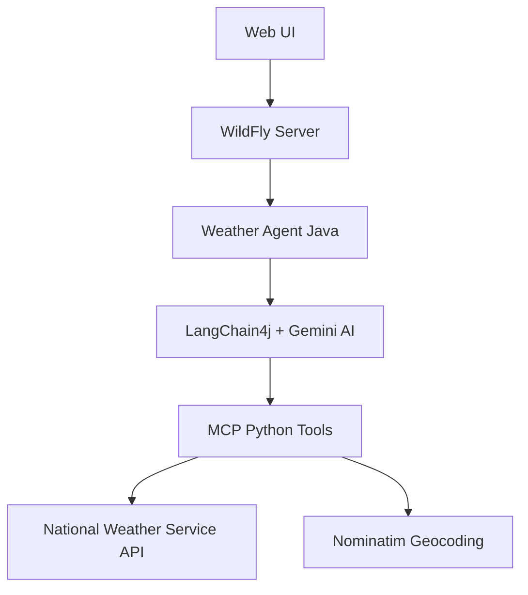

# Weather Agent

An AI-powered weather forecasting application that combines Java Enterprise (Jakarta EE) with Python MCP (Model Context Protocol) tools to provide natural language weather queries using real-time data from the National Weather Service.

## 🏗️ Architecture



## 🚀 Features

- **Natural Language Processing**: Powered by Google's Gemini AI model
- **Real-time Weather Data**: Official National Weather Service API integration
- **Multiple Query Types**: 
  - Weather alerts by state
  - Forecasts by coordinates
  - Forecasts by city/state
- **Streaming Responses**: Real-time AI response streaming
- **Enterprise Ready**: Built on WildFly application server
- **Agent-to-Agent Communication**: A2A SDK integration

## 📦 Components

### Java Backend (WildFly)
- **WeatherAgent**: AI service interface using LangChain4j
- **WeatherAgentExecutor**: Task execution and lifecycle management
- **WeatherAgentCardProducer**: Agent metadata and capabilities
- **RestApplication**: JAX-RS application entry point

### Python MCP Server
- **weather_mcp.py**: MCP-compliant tool server providing:
  - `get_alerts(state)`: Active weather alerts for US states
  - `get_forecast(latitude, longitude)`: Detailed forecasts by coordinates
  - `get_forecast_by_city(city, state)`: User-friendly city-based forecasts

### Web Frontend
- Bootstrap-based responsive UI
- Real-time streaming chat interface
- EventSource for server-sent events

## 🛠️ Technology Stack

### Java Stack
- **Jakarta EE 10.0.0** - Enterprise Java platform
- **WildFly 36.0.1.Final** - Application server
- **LangChain4j 1.1.0** - AI orchestration framework
- **SmallRye LLM 0.0.6** - AI service integration
- **A2A SDK 0.2.4-SNAPSHOT** - Agent communication protocol

### Python Stack
- **MCP 1.5.0** - Model Context Protocol
- **geopy 2.4.1** - Geocoding services
- **httpx** - Async HTTP client
- **FastMCP** - MCP server framework

## 📋 Prerequisites

- **Java 17+**
- **Maven 3.8+**
- **Python 3.13+**
- **[uv](https://github.com/astral-sh/uv)**
- **Google Gemini API access** (configured in WildFly)

## 🚀 Quick Start

### 1. Clone and Build Java Application

```bash
git clone git@github.com:ehsavoie/a2a-weather.git
cd a2a-weather
mvn clean package
```

### 2. Configure AI Model

After running this command your WildFly server is configured with:
- Gemini AI model access
- MCP stdio tool provider configuration
- Appropriate logging (see `src/scripts/configure_logger.cli`)

Check the `ai` subsystem configuration in `target/server/standalone/configuration/standalone.xml`  to ensure everything is properly set up.

To enable Gemini access, define the following environment variable:
```bash
export GEMINI_API_KEY=<YOUR_GEMINI_API_KEY>
```

### 3. Start Agent on WildFly

The above `mvn package` command built WildFly with everything configured and the agent deployed.

```bash
./target/server/bin/standalone.sh 
```

You can use the [a2a inspector](https://github.com/a2aproject/a2a-inspector) to test and play with this agent.


## 💬 Usage Examples

### Weather Alerts
```
"What are the current weather alerts for California?"
```

### City Weather
```
"What's the weather forecast for Los Angeles, CA?"
```

### Coordinate-based Forecast
```
"Give me the weather forecast for coordinates 34.05, -118.25"
```

## 🔧 Configuration

### WildFly Configuration
- **Chat Model**: `gemini` (configured in WildFly AI feature pack)
- **Tool Provider**: `mcp-stdio` 
- **MCP Server**: Located in `extra-content/standalone/mcp/`

### Environment Variables
Configure your Gemini API credentials and any required environment variables in your WildFly configuration.

## 📁 Project Structure

```
weather/
├── src/main/java/org/wildfly/ai/a2a/weather/
│   ├── WeatherAgent.java              # AI service interface
│   ├── WeatherAgentExecutor.java      # Task execution logic
│   ├── WeatherAgentCardProducer.java  # Agent metadata
│   └── RestApplication.java           # JAX-RS application
├── src/main/webapp/
│   ├── index.html                     # Main UI
│   └── resources/                     # Static assets
├── extra-content/standalone/mcp/
│   ├── weather_mcp.py                 # Python MCP server
│   └── pyproject.toml                 # Python dependencies
└── pom.xml                            # Maven configuration
```

### Tools

The MCP server provides three main tools:
- `get_alerts`: Test with 2-letter state codes
- `get_forecast`: Test with lat/lng coordinates
- `get_forecast_by_city`: Test with city/state combinations

## 🤝 Contributing

1. Fork the repository
2. Create a feature branch
3. Make your changes
4. Test thoroughly
5. Submit a pull request

## 📄 License

Licensed under the Apache License, Version 2.0. See the LICENSE file for details.

## 🆘 Support

For issues and questions:
- Check the WildFly and LangChain4j documentation
- Verify MCP server connectivity
- Ensure National Weather Service API accessibility
- Review application logs for detailed error information
 
